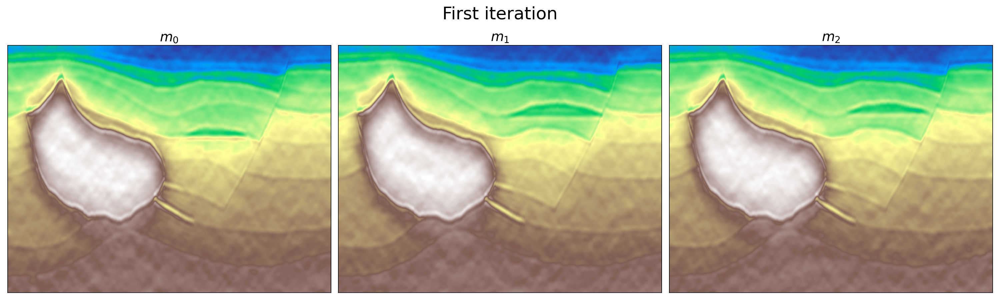
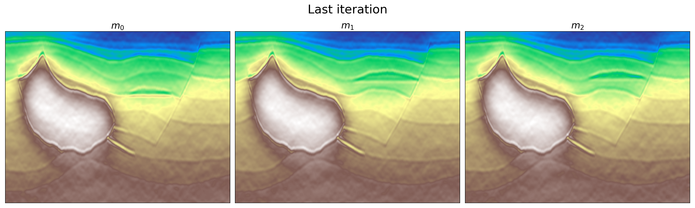
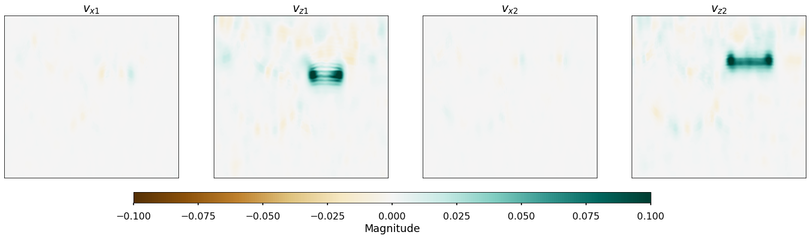
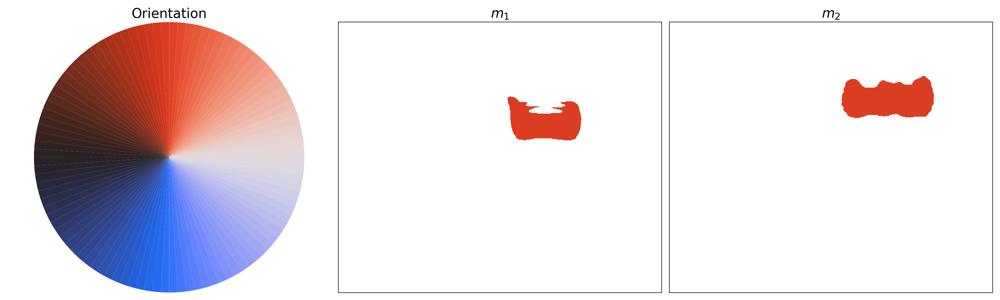

This work was presented as the final project for Numerical Optimization course (AMCS211) at KAUST, on May 2023.

Seismic inversion is a key player in locating hydrocarbon reserves in the oil and gas industry. 4D seismic inversion takes it a step further by monitoring reservoir changes over time for improved management and production optimization. Despite its usefulness, the high data dimensionality often complicates the accurate recovery of subsurface properties. 

To tackle this issue, we propose implementing a novel regularization operator for 4D seismic inversion. This operator utilizes the target's temporal evolution within a comprehensive spatio-temporal reconstruction scheme. Our approach is inspired by the spatio-temporal modeling framework suggested by Lucka et al. (2018), which incorporates a priori information about the problem configuration. 

## Problem Formulation

Post-stack seismic inversion involves solving an optimization problem to retrieve the natural logarithm of the acoustic impedance model for given post-stack seismic data. The post-stack modeling operator G is defined as the chain of a time derivative operator and a convolution operator created for a given wavelet. 

The biconvexity of the problem comes from the term that ensures a relationship between the image sequence and the corresponding motion field sequence. This term enforces an optical flow equation from the field of computer vision, and it measures the least-squares error of a forward difference discretization of this equation.

## Implementation Details

Our numerical implementation of the Alternate Convex Search (ACS) workflow follows a sequence of iterative steps, involving an initial solution for m using a primal dual with Total Variation (TV) and subsequent solutions for m and v using various defined parameters and operators. The TV regularization, which enhances the blocky aspect of the solution, is implemented using a forward difference operator, while all matrices are defined using linear operators to make use of the sparsity in the matrices involved. We used the Primal-Dual algorithm by Chambolle and Pock (2011) as the optimization algorithm. 

The most crucial step is tuning the regularization parameters. We discovered that a balance between the TV regularization applied to the model and velocity vectors and the optical flow constraint is crucial. Too high weights can suppress amplitudes and contrast in the solutions. Simultaneously, a balance must be struck with the optical flow constraint to prevent the creation of ghosting effects between frames, while still aiding in defining the velocity field.

## Results

To test the proposed implementation, we used a set of three synthetic models resembling a geologically feasible scenario. Upon comparing the initial and final iterations, we found that the starting point established using the TV constraint is quite effective, despite being a bit noisy. Interestingly, the algorithm successfully estimates the motion by gauging the vertical displacement between the frames.

We further refined the motion estimation results by calculating the orientation angle given the velocity components. This helped us to improve the clarity of the image and reduce the distortion caused by noise and the influence of the multiple operators.

## Conclusion

Our project has provided a deeper understanding of the optical flow as a constraint in a seismic inversion algorithm. It has emphasized the significance of careful regularization parameter selection and has shown the importance of balancing the Total Variation regularization applied to the model and velocity vectors. We are excited to continue experimenting with varying parameters and computational strategies to further refine our outcomes. 

The code and dataset used to produce these results can be found in [this GitHub repository](https://github.com/dchamorror/SeismicTVFlow.git). The detailed report of this implementation with a more in depth mathematical derivations can be downloaded from [here](/tvflow_report.pdf).

## References
1. Burger, Martin et al. (Dec. 1, 2017). “A Variational Reconstruction Method for Undersampled Dynamic X-Ray Tomography Based on Physical Motion Models”. In: Inverse Problems 33.12, p. 124008. issn: 0266-5611, 1361-6420. doi: 10.1088/1361-6420/aa99cf. url: https://iopscience.iop.org/ article/10.1088/1361-6420/aa99cf (visited on 04/30/2023).
2. Chambolle, Antonin and Thomas Pock (May 2011). “A First-Order Primal-Dual Algorithm for Con- vex Problems with Applications to Imaging”. In: Journal of Mathematical Imaging and Vision 40.1, pp. 120–145. issn: 0924-9907, 1573-7683. doi: 10.1007/s10851-010-0251-1. url: http://link. springer.com/10.1007/s10851-010-0251-1 (visited on 05/08/2023).
3. Lucka, Felix et al. (Jan. 2018). “Enhancing Compressed Sensing 4D Photoacoustic Tomography by Si- multaneous Motion Estimation”. In: SIAM Journal on Imaging Sciences 11.4, pp. 2224–2253. issn: 1936-4954. doi: 10.1137/18M1170066. url: https://epubs.siam.org/doi/10.1137/18M1170066 (visited on 04/30/2023).